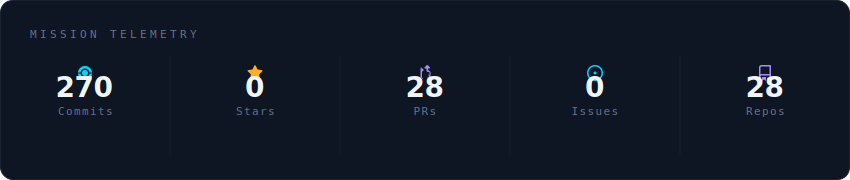

<!-- Galaxy Profile README Template
     Customize this file with your own info, then rename it to README.md
     in your GitHub profile repo (github.com/YOUR_USERNAME/YOUR_USERNAME).
     The SVG paths below point to assets/generated/ which are auto-generated
     by the GitHub Actions workflow or by running: python -m generator.main -->

  

 

  

 

  

 

  

 

<strong>Mais sobre mim</strong>

 

> Olá! Eu sou **Renan Paulino**, focado na criação de **experiências digitais, acessíveis e funcionais**.  

Atualmente estou explorando **soluções front-end e back-end**.  

**Paixões tech:** React, Tailwind, JavaScript, Python, Java e escrever código limpo e escalável.

**Foco atual:** aprimorar minhas habilidades e contribuir para projetos que tenham **impacto real**.

**Fora do código:** Literatura (Dostoiévski), e música com propósito (Emicida, BK, Sabotage, Kendrick Lamar).  

**Atualmente em** São Paulo, SP

 

  
  

